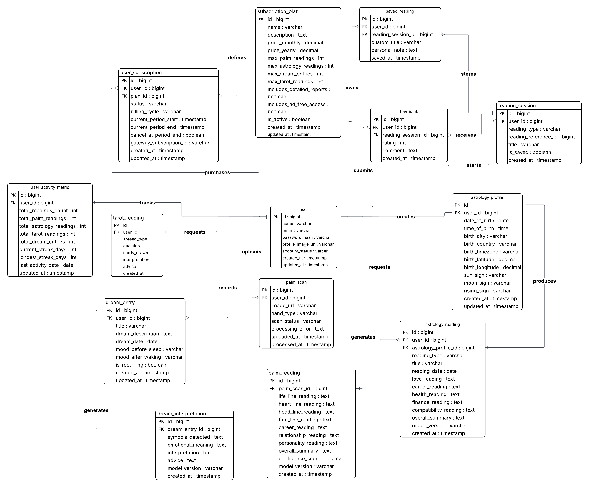

<p align="center">
  
</p>

<h1 align="center">Fortune Teller</h1>

<p align="center">
An AI-powered fortune telling platform that combines tarot readings, dream interpretation, astrology, and personalized insights into one modern web application.
</p>

---

# Overview

Fortune Teller is a full-stack web application designed to provide users with personalized fortune telling experiences using modern web technologies and AI-powered features.

This repository contains both the frontend and backend applications along with all project documentation required for development.

The purpose of this repository is to provide a consistent development environment so every team member can clone, configure, and run the project successfully before implementation begins.

---

# Technology Stack

## Frontend

- Next.js
- React
- Tailwind CSS

## Backend

- Node.js
- Express.js

## AI / Machine Learning

- Python
- Machine Learning Models

## Version Control

- Git
- GitHub

---

# Project Structure

```text
fortune-teller/
│
├── ai/                      # AI and machine learning modules
├── backend/                 # Backend API
├── docs/                    # Project documentation
│   └── Database/
│       └── Fortune_Teller_ERD.png
│
├── frontend/                # Next.js frontend
│   ├── app/
│   ├── components/
│   ├── hooks/
│   ├── lib/
│   ├── public/
│   ├── styles/
│   └── package.json
│
├── .gitignore
├── LICENSE
└── README.md
```

---

# System Architecture

## Entity Relationship Diagram

<p align="center">
  
</p>

The database architecture defines the relationships between users, subscriptions, readings, dream journals, astrology charts, notifications, payments, support tickets, and other core entities used throughout the system.

---

# Prerequisites

Before running the project, install:

- Git
- Node.js (v18 or later)
- npm
- Visual Studio Code (recommended)

Verify installation:

```bash
git --version
node -v
npm -v
```

---

# Installation

Clone the repository.

```bash
git clone https://github.com/fortune-teller-app/fortune-teller.git
```

Move into the project.

```bash
cd fortune-teller
```

Install frontend dependencies.

```bash
cd frontend
npm install
```

If backend dependencies exist:

```bash
cd ../backend
npm install
```

---

# Running the Application

## Frontend

```bash
cd frontend
npm run dev
```

Application URL:

```
http://localhost:3000
```

## Backend

When backend implementation is available:

```bash
cd backend
npm start
```

---

# Environment Variables

Create a `.env` file using the provided `.env.example`.

Example:

```env
NEXT_PUBLIC_API_URL=http://localhost:5000

PORT=5000

DATABASE_URL=

JWT_SECRET=
```

---

# Development Workflow

Create a new feature branch.

```bash
git checkout -b feature/your-feature-name
```

Commit changes.

```bash
git add .
git commit -m "Describe your changes"
```

Push changes.

```bash
git push origin feature/your-feature-name
```

Create a Pull Request for review.

---

# Development Environment Verification

The development environment is considered ready when:

- Repository can be cloned successfully.
- Dependencies install without errors.
- Frontend starts successfully.
- Backend dependencies install successfully (when applicable).
- Environment variables are configured.
- Project follows the agreed folder structure.
- Version control is functioning correctly.
- Team members can successfully run the project locally.

---

# Contributors

| Team Member | Responsibilities |
|--------------|------------------|
| **SM Tausif** | Database Design, Backend Development |
| **Bora Dag** | Frontend Development, Deployment |
| **Berke Balibasa** | AI & Machine Learning |
| **Mustafa Abidi** | Backend Development, Testing |

---

# Test Users

Use the following test accounts to explore the application.

| User | Email | Password | Plan |
|------|-------|----------|------|
| **Liora Vance** | `liora@example.com` | `seeker123` | Free |
| **Fiora Vance** | `fiora@example.com` | `oracle123` | Oracle |

Log in with either account to compare the **Free** and **Oracle** experiences.

Authentication is handled using an **HTTP-only cookie** (`mock_user_id`), allowing the user session to persist across page refreshes within the current browser session.

> **Note**
>
> Registered users are stored **in memory only** for the current server session. Any users created during testing will be removed when the development server is restarted.

---

# License

This project is licensed under the MIT License.
